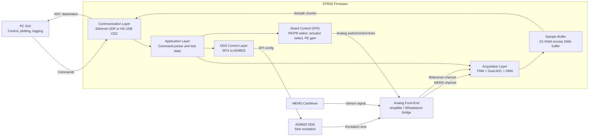
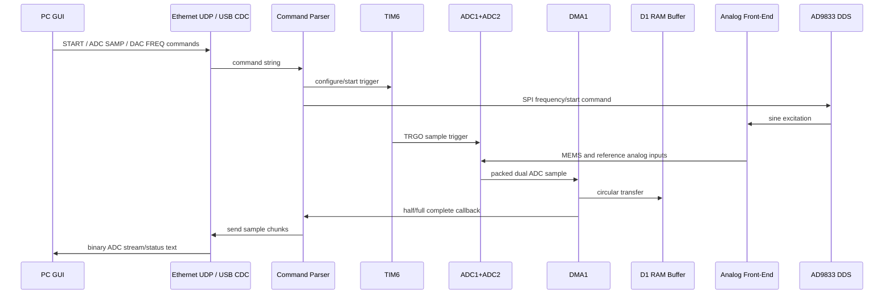
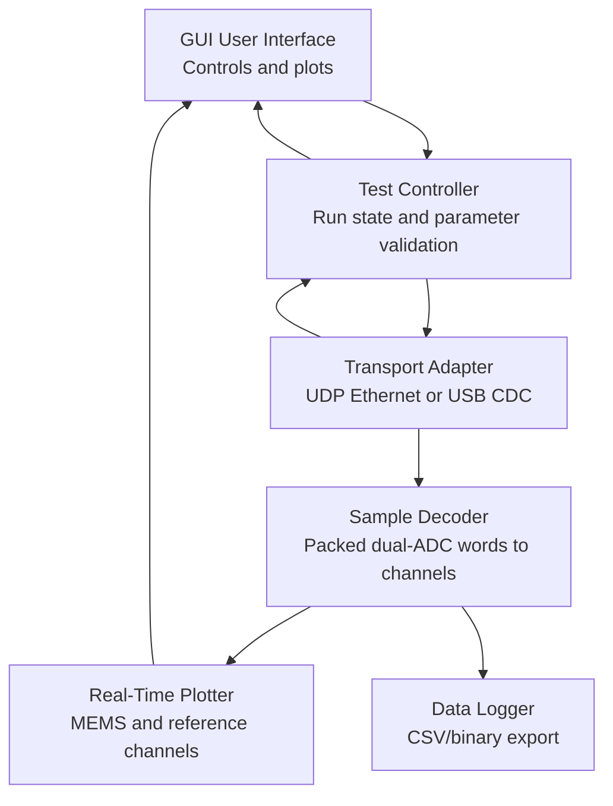

# MEMS Cantilever Testbench Firmware System Architecture

## 1. System Purpose

The firmware controls a MEMS cantilever testbench using an STM32 Nucleo board. It generates or selects an excitation signal, captures two analog channels from the analog front-end, streams acquired samples to a PC GUI, and receives GUI commands for acquisition and test configuration.

Current firmware target:

- Board: Nucleo-H723ZG
- PC link: Ethernet using LwIP UDP
- Excitation generator: AD9833 DDS controlled by SPI1
- Acquisition: dual ADC simultaneous sampling using ADC1 and ADC2

Optional future target:

- Board: Nucleo-H7S3L8
- PC link: high-speed USB CDC instead of Ethernet UDP

## 2. Top-Level Architecture



## 3. Firmware Layers

### Application Layer

Implemented mainly in `Core/Src/main.c`.

Responsibilities:

- Initialize clocks, MPU, cache, GPIO, DMA, ADC, TIM6, LwIP, UART, and SPI.
- Maintain runtime state:
  - ADC running/stopped
  - active ADC buffer size
  - DDS running/stopped
  - DDS frequency
  - PE/PR board mode
  - actuator source
  - PE gain index
- Parse GUI commands received over the communication interface.
- Apply configuration changes to acquisition, DDS, and GPIO-controlled analog routing.

Main command handlers:

- `BOARD?`
- `BUF,<samples>`
- `ADC SAMP,<Hz>`
- `ADC RES,<bits>`
- `START`
- `STOP`
- `DAC START`
- `DAC STOP`
- `DAC FREQ,<Hz>`
- `MODE,PE`
- `MODE,PR`
- `ACTUATOR,DDS`
- `ACTUATOR,FG`
- `ACTUATOR,STM32`
- `PE GAIN,<0..3>`

### Communication Layer

Current Nucleo-H723ZG implementation:

- Ethernet MAC + LAN8742 PHY
- LwIP without RTOS
- Static IP: `192.168.0.123`
- PC GUI destination IP: `192.168.0.100`
- ADC/status transmit port: UDP `5005`
- command receive port: UDP `5006`

The main loop calls `MX_LWIP_Process()` to poll Ethernet packets, process UDP commands, and handle LwIP timeouts.

Future Nucleo-H7S3L8 option:

- Replace Ethernet/LwIP UDP transport with USB HS CDC.
- Keep the same application command strings.
- Encapsulate ADC sample chunks in CDC bulk transfers.
- Preserve the same GUI control model, changing only the physical transport and packet framing.

### Acquisition Layer

Acquisition is timer-triggered and DMA-driven.

- Timer: TIM6
- TIM6 trigger output: update event / TRGO
- ADC mode: dual regular simultaneous mode
- ADC master: ADC1
- ADC slave: ADC2
- ADC1 channel: ADC channel 15
- ADC2 channel: ADC channel 5
- Default resolution: 16-bit
- DMA: DMA1 Stream0, circular mode, peripheral-to-memory
- Buffer: `adc_buffer[]` in `.RAM_D1`, 32-byte aligned
- Maximum buffer size: 4096 `uint32_t` words
- Each `uint32_t` word carries packed dual-ADC sample data from the ADC multimode data register.

Data movement:

1. TIM6 emits a trigger at the configured sampling rate.
2. ADC1 and ADC2 sample simultaneously.
3. ADC multimode hardware packs both conversion results.
4. DMA transfers packed samples into `adc_buffer`.
5. Half-complete and complete DMA callbacks split the buffer into chunks.
6. Each chunk is cache-cleaned and sent to the GUI.

### Signal Generation Layer

The AD9833 DDS is controlled through SPI1.

- SPI mode: master, transmit only
- DDS chip select: PD14
- DDS reference clock constant in firmware: 25 MHz
- Frequency tuning word is calculated from:

```text
tuning_word = requested_frequency * 2^28 / 25 MHz
```

DDS states:

- stopped: reset/sleep command is sent to AD9833
- running: B28 mode is enabled and the configured frequency word is applied

### Board Control GPIO Layer

The firmware controls analog front-end routing and gain through GPIOs.

- PE/PR select: PE9
- actuator source select: PE11
- BNC/ADC routing: PE14
- PE gain bit A0: PE13
- PE gain bit A1: PG14
- DDS chip select: PD14

Board modes:

- PE mode
- PR mode

Actuator modes:

- DDS excitation from AD9833
- external function generator
- STM32 DAC path placeholder

## 4. Runtime Data Flow



## 5. GUI Architecture

The PC GUI should be separated into these modules:



Recommended GUI functions:

- Connect/disconnect to board.
- Select transport:
  - Ethernet UDP for Nucleo-H723ZG.
  - USB HS CDC for Nucleo-H7S3L8.
- Configure sample rate, ADC resolution, and buffer size.
- Start/stop ADC acquisition.
- Start/stop DDS.
- Set DDS frequency.
- Select PE/PR mode.
- Select actuator source.
- Select PE gain.
- Plot MEMS and reference channels in real time.
- Save raw and processed data.
- Show board status and connection health.

## 6. Communication Protocol

### Command Direction

GUI to STM32:

```text
ASCII command strings
Ethernet: UDP port 5006
USB option: CDC OUT endpoint
```

STM32 to GUI:

```text
Status text and binary ADC chunks
Ethernet: UDP port 5005
USB option: CDC IN endpoint
```

### Existing Commands

| Command | Purpose |
| --- | --- |
| `BOARD?` | Request board identification |
| `BUF,<samples>` | Set active DMA buffer size |
| `ADC SAMP,<Hz>` | Set TIM6-derived ADC sampling rate |
| `ADC RES,<bits>` | Set ADC resolution: 10, 12, 14, or 16 |
| `START` | Start ADC acquisition |
| `STOP` | Stop ADC acquisition |
| `DAC START` | Start DDS output |
| `DAC STOP` | Stop DDS output |
| `DAC FREQ,<Hz>` | Set AD9833 output frequency |
| `MODE,PE` | Select PE board mode |
| `MODE,PR` | Select PR board mode |
| `ACTUATOR,DDS` | Select AD9833 DDS excitation |
| `ACTUATOR,FG` | Select external function generator |
| `ACTUATOR,STM32` | Select STM32 actuator path |
| `PE GAIN,<0..3>` | Set PE gain GPIO code |

## 7. Hardware Interface Summary

| Interface | STM32 Peripheral | External Block | Purpose |
| --- | --- | --- | --- |
| SPI1 | SPI master TX | AD9833 DDS | Configure sine-wave excitation |
| ADC1 | ADC channel 15 | Analog front-end reference/MEMS path | Dual simultaneous acquisition |
| ADC2 | ADC channel 5 | Analog front-end reference/MEMS path | Dual simultaneous acquisition |
| TIM6 | TRGO update | ADC trigger | Fixed-rate sampling |
| DMA1 Stream0 | ADC1 request | D1 RAM buffer | Circular sample transfer |
| Ethernet | MAC + LAN8742 PHY | PC GUI | UDP command/data link |
| USB HS CDC | USB device FS/HS stack | PC GUI | Alternative command/data link |
| GPIO | PE9, PE11, PE13, PE14, PG14, PD14 | Analog routing and DDS CS | Mode/gain/source control |
| UART3 | USART3 | Debug console | Optional debug output |

## 8. Recommended Final Block Diagram

Use this structure for the final report diagram:

```text
PC GUI
  |  commands: ASCII strings
  |  data: ADC binary stream + status
  v
Communication Interface
  - Nucleo-H723ZG: Ethernet UDP + LwIP
  - Nucleo-H7S3L8: USB HS CDC
  |
  v
STM32 Application Firmware
  - command parser
  - acquisition state machine
  - DDS control
  - board mode/gain control
  |
  +--> AD9833 DDS over SPI1 --> analog excitation
  |
  +--> GPIO control lines --> analog front-end routing/gain
  |
  +--> TIM6 trigger --> dual ADC simultaneous sampling
                         |
                         v
                     DMA circular buffer
                         |
                         v
                  streamed sample chunks to GUI

Analog Front-End
  - amplifier / Wheatstone bridge
  - MEMS cantilever signal
  - reference signal
```

## 9. Notes for Improvement

- Add an explicit packet header for ADC data containing sequence number, sample rate, resolution, channel format, and payload length.
- Add acknowledgements for configuration commands.
- Add error/status messages for invalid commands.
- Consider moving UDP/USB behind a common transport API so the same application layer supports both Nucleo-H723ZG and Nucleo-H7S3L8.
- Consider moving ADC streaming out of interrupt callbacks into a main-loop or RTOS task queue if packet handling becomes too heavy.
